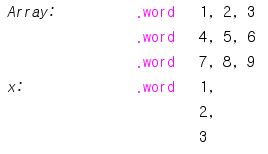
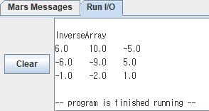
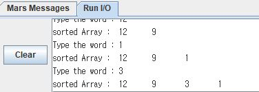

# MIPSstudy
### 2인 팀 프로젝트로 진행한 3문제
* Q1: Calculate Ax = b (A: 3x3, x: 3x1) (40)
    - 정수 행렬 A, x의 값은 임의로 설정 (미리 저장 or 실행 후 입력) 
    - Input  
        
    - output  
          

* Q2: Calculate an inverse of A (A: 3x3) (30) 
    - 정수 행렬 A의 값은 임의로 설정 (미리 저장 or 실행 후 입력)
    - Single-precision floating point (float) 연산 결과 출력
    - Input  
        
    - output  
          

* Q3: Heap Sort (30) 
    - 반복적으로 정수가 하나씩 입력 되면 (최소 5회),
    - Heap sort 알고리즘으로 내림차순 정렬 후 출력하는 프로그램을 작성하시오.
    - result  
          
          

**프로젝트 채점 진행방법**  
* A source code file: 60%
    - Append detail comments in your code
* A document describing your algorithm: 40%
    - File name must be the same with its code file.
    - You can use one of these word processors (Word/Hwp)
    - You have to explain your code and algorithm in detail.
    - Your document will be used to determine partial credit if the code fails to run. 

**프로젝트 후기**  
프로젝트 진행에 있어서 MIPS를 이용한 Assembly언어를 사용하게 되었는데, 몰랐던 내용을 좀 더 공부하면서
컴퓨터에 대해 잘 알게 된 것 같다. 다만 아쉬운점은 내가 배웠던 내용들인 calling convention이나, callee-save 등을
프로그램이 작고 레지스터를 모두 써도 남는다는 생각에 사용하지 않았던 것들이 지적받아 중요성을 깨달았다.
이게 프로그램이 작아서 그렇다해도, 실전에서 사용할 땐 훨씬 큰 코드를 만지면서 convetion들을 지켜야 한다는 것이
마음에 새겨지는 계기가 된 것 같다.

## Assembly 언어를 사용한 MIPS공부, Mars4_5를 이용하였습니다.
* 아래의 동영상을 통해 공부하였습니다.
    - https://www.youtube.com/playlist?list=PL5b07qlmA3P6zUdDf-o97ddfpvPFuNa5A
* Mars4_5 다운로드 사이트
    - http://courses.missouristate.edu/kenvollmar/mars/
    - Java SE 설치 및 컴퓨터 Path 경로 설정을 해주어야 합니다.